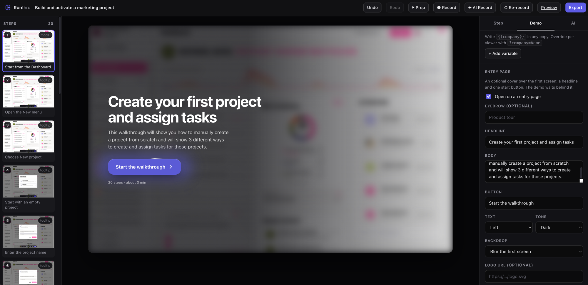
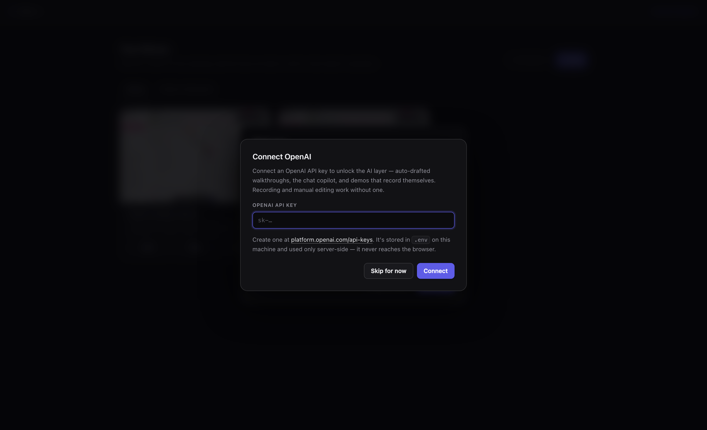

<h1 align="center">
  
  Runthru
</h1>

<p align="center">
  <strong>Record a runthru of any web app. Edit the story by hand, or by talking to an AI.<br>
  Export a static interactive demo you can host anywhere.</strong>
</p>

<p align="center">
  Same category as Storylane and Guideflow, but local, inspectable, and AI-first: instead of<br>
  hand-tweaking thirty tooltips you say <em>"tighten every step and aim it at a CFO"</em> and it happens.
</p>

<p align="center">
  
</p>

<p align="center">
  <em>Steps down the left, a live interactive preview in the middle, and the inspector on the
  right. Here it is the optional entry page being written — every change lands on the preview
  as you type.</em>
</p>

<p align="center">
  <strong><a href="https://runnit.io/demos/i-want-you-to-create-a-demo-of-from-the-dashboard-clickin/">▶ See a demo Runthru exported, live →</a></strong><br>
  <sub>A real recording, published as a static bundle — entry page, guide cursor, replayed typing and all.</sub>
</p>

<p align="center">
  <sub>MIT licensed. A personal project, shared as is, with no warranty. You are responsible
  for what you record. See <a href="#disclaimer">Disclaimer</a>.</sub>
</p>

## Quick start

```bash
./run.sh
```

That installs dependencies, downloads the recording browser if it's missing, and opens
[localhost:4400](http://localhost:4400). On first launch the studio offers to connect an API
key — OpenAI or Anthropic, whichever you have. Paste one and it's verified and saved to `.env`
for you. It's skippable: recording and manual editing work without a key; only the AI features
need one.



```bash
./run.sh exports        # serve exported bundles → http://localhost:4500
PORT=5000 ./run.sh      # different port
```

Or drive it directly: `npm install && npm run studio`.

Run the tests with `npm test`. They use Node's built-in test runner, so there is nothing extra
to install, and they cover the parts that are worth pinning: the op table every mutation goes
through, the persistence layer's undo history and per-demo write lock, and the static export.

Then: **New** → name it and give it a URL → a real Chromium window opens → drive it as you
normally would. Every click, form entry and page change becomes a step. Hit **Finish** in the
bar at the bottom, and let AI draft the story.

## How recording works

The recorder intercepts your click, snapshots the screen *as it looked before you acted*, then
replays the click so the app carries on normally. That matters: a demo step is "here is the
screen, click this". Capturing only the result would lose the screen that invited the click.

Each step is a **self-contained snapshot**: every stylesheet folded in (including cross-origin
ones, fetched server-side), shadow DOM re-emitted declaratively, canvases rasterised, typed
values and scroll offsets written back, and every image and font downloaded and content-hashed
so thirty steps of the same app share one copy of the logo. Snapshots contain **no JavaScript**:
page scripts are stripped and none are added back.

**Snapshots wait for the page to finish drawing.** Before freezing a screen the recorder waits
for in-flight requests, then for the DOM to stop changing, images to load and every loading
placeholder (skeletons, spinners, `aria-busy`) to clear. Otherwise a dashboard that fetches
each widget separately gets captured as a grid of empty cards. Perpetually animating pages are
capped rather than waited on forever. If your app is unusually slow, scale the whole budget with
`DEMO_SETTLE_MS=5000` in `.env` (the default behaves like 2500).

**Recording waits for the start URL.** Nothing is captured until the browser actually reaches
the demo's start page, so signing in and clicking through to the right screen never become steps,
and the HUD shows an amber "waiting" dot until you arrive. Landing on the start page arms
recording and captures it as step 1. If you ever want to record from somewhere else, pressing
**Capture step** arms recording wherever you are.

The browser profile persists in `.profiles/`, so you log into the target app once and stay
logged in across sessions. **⚑ Prep** opens that same browser with nothing attached (no
recorder, no steps), so you can sign in, seed data or dismiss a first-run tour before the take.
Hitting **Record** hands the profile straight over, so everything you set up is still there.

**Every recording polishes itself when it finishes**, AI-driven or hand-driven. The story is
written, then the same model watches the take back, screenshot by screenshot, and per step
decides keep, edit or drop. It is held to four things: every label must describe the action
actually taken on that exact screen; every error, failed action and wrong turn is removed rather
than explained away; the result must read start to finish as one clean tutorial; and any step
whose purpose is not obvious from its own screen is either rewritten or cut. Progress shows in
the recording bar, removals are listed with reasons, and the pass is confined to the steps that
session actually shot, so topping a demo up can never reword or prune takes you already curated,
and a session that captured nothing polishes nothing. Within that scope it will never cut more
than half, or leave the demo under three steps. If it wanted to cut more, it says so. One
**Undo** reverses the whole thing. Run it again over the whole demo any time with
**Review & polish** in the AI pane.

**Re-record** shoots the whole demo again. Edit the description (that *is* the brief), press
**↻ Re-record**, and the AI replaces every step by running the scenario from scratch. The
previous take goes through the history system, so one **Undo** brings it back intact (snapshots
are never overwritten: each capture gets a permanent sequence number). Sign-in details from the
last run are reused from memory, and the per-demo browser profile usually stays logged in, so
re-recording normally asks for nothing.

**AI Record** lets the model run the tutorial for you. Give it a scenario ("create a project
for a beverage client and add two tasks"), optional docs URL, and sign-in credentials. It
opens the recording browser, signs in (unrecorded, thanks to the start-URL gate), reads each
page, and performs the flow with realistic data. Its clicks and typing go through the same
recorder as yours, so every step gets click points, typed values and whole-control targets,
and it drafts the step copy when it finishes. Credentials are held in memory for the run only.

## Editing

Three panes: filmstrip (drag to reorder), live preview, inspector.

Per step you control the annotation (tooltip / modal / caption / hotspot / none), copy, the
anchored element (**Pick** lets you click an element in the preview), placement, what advances
the viewer, explicit jumps, branches, and overlays.

**Overlays** (blur a revenue figure, hide an element, swap text, replace an image) are applied
at playback, never baked into the capture. The recording stays pristine and every edit reverses.

**Branches** turn a step into a fork: each choice is a button sending the viewer down a
different path. **Variables** let you write `{{company}}` in any copy and override it per viewer
with `?company=Acme` on the share URL.

## The entry page

Optional, and off by default: a cover laid over the demo's own first screen with a headline, a
supporting line and one start button. The tour waits behind it until the button is pressed —
its cursor doesn't move, a timed step doesn't run out, and the player's own chrome (progress
bar, dots, **Hide guide**) stays out of the way until the viewer is actually in.

Switch it on under **Entry page** in the Demo pane. Everything on it is optional and everything
is yours: eyebrow, headline, body, button label, logo. Leave the headline and body empty and
they fall back to the demo's name and description, so it looks finished before you write a word.

- **Text** — left, over the screen, or centred.
- **Tone** — light type on a darkened screen, or dark type on a lightened one.
- **Backdrop** — *blur* frosts the first screen behind the words, *dim* darkens it, *clear*
  pools a wash under the copy and leaves the rest of the product on show, and *solid* hides
  the capture entirely behind a gradient built from your accent colour (for a demo whose first
  screen is a login or an empty state).
- **Animate the start button** — a breathing aura in the accent colour, a highlight that travels
  the rim, and a slow sheen across the face. On by default, and skipped entirely under
  `prefers-reduced-motion`.
- **Show step count and rough length** — "20 steps · about 3 min" under the button.

**Preview it** opens the cover over the editing canvas, and every change lands on it as you
type. It never opens by itself while you edit, or it would sit in front of every step you were
trying to work on. Enter, Space or → start the tour from the keyboard.

If lead capture is set to ask *before* the demo, the order is cover → form → step one: the
viewer decides to take the tour first, and is only asked for their details once they have.

## Playback

The left and right arrow keys step through the demo.

**On phones the guidance docks to an edge instead of floating over the screen.** A 1440-wide
capture shown at ~342px is far too small to host a card on top of it: measured on a 390px
phone, a centred modal covered 82% of the screen and collided with both the arrow bar and the
Hide guide button. Below 560px every annotation — tooltip, modal or caption — becomes a sheet
docked to the bottom edge with compact type, and back/next move inside it, so the floating
arrow bar stands down and there is nothing left to overlap. If a step's target sits low enough
that the sheet would cover it, the sheet flips to the top edge instead. The Hide guide button
is the one control that can't move into the card (it has to survive hiding the guide), so it
goes icon-only and takes the corner furthest from both the sheet and the target.

Viewers get a **Hide guide** button in the bottom-right corner. It drops the dimming,
spotlight, tooltip and cursor so they can look at the product screen exactly as captured, then
flips to **Show guide** to bring the tour back (Esc works too). The back/next bar, the progress
bar and the toggle itself never disappear. Hiding the guide is a peek at the screen, not an
exit from the tour, and steps can still be stepped through while it is off.

Playback doesn't just label each screen. It **re-enacts the recorded session**. A guide cursor
glides to each step's target (landing on the exact spot you clicked while recording) and ripples
when the step advances. Steps captured from form entry replay the typing keystroke by
keystroke into the field, with a screencast-style key readout, and Enter-to-submit steps flash an
`Enter ⏎` keycap. Both are cosmetic: they never gate navigation, are cancelled cleanly by it, and
are skipped under `prefers-reduced-motion`. Toggle them per demo in the inspector
(**Guide cursor**, **Replay typing**) or via the `cursor` / `typing` playback settings.

## The AI layer

Your key lives in `.env` (written by the first-run setup, or by hand) and is used **only
server-side**. It never reaches the browser.

Either provider works. `OPENAI_API_KEY` talks to OpenAI's chat completions; `ANTHROPIC_API_KEY`
talks to Claude's messages API. The key's prefix is what identifies it, so the setup dialog
takes both without asking you which is which. Set both and `AI_PROVIDER=openai|anthropic`
decides — connecting a key from the UI writes that line for you, so the last key you connect
wins.

Everything above `server/llm.js` is written once, in the OpenAI request shape. `llm.js` owns
the difference: for an Anthropic key it translates the request on the way out (system prompts
lifted out of the messages array, tool calls and screenshots into content blocks, JSON schemas
into `output_config`) and the reply on the way back. The drafting, review, chat and autopilot
passes don't know which API answered.

The model is pinned in `.env`:

```
OPENAI_MODEL=gpt-5.5
ANTHROPIC_MODEL=claude-opus-5
```

Comment those out and the studio asks your key which models it can actually see on boot, then
picks the best from the preference list in `server/llm.js`, so a retired model id never breaks
anything. To see your options:

```bash
curl https://api.openai.com/v1/models -H "Authorization: Bearer $OPENAI_API_KEY"
curl https://api.anthropic.com/v1/models -H "x-api-key: $ANTHROPIC_API_KEY" -H "anthropic-version: 2023-06-01"
```

Model generations disagree about which request parameters they accept. The gpt-5 family, for
one, rejects any `temperature` other than the default; older Claude models reject adaptive
thinking, and not every one of them can be held to a JSON schema. Rather than carry a
per-family table that goes stale, the transport reads the rejection, drops the offending
parameter — falling back to asking for JSON in the prompt where a schema won't take — remembers
it for that model and retries. Switching models is a one-line change with no other edits. The
first call after a restart may pay one extra round-trip while that is learned.

Three ways in:

- **Chat copilot**: describe a change and it applies it. It calls the *same* operations the UI
  uses (`docops.js`), so it can do exactly what you can do and no more. A whole turn, however
  many edits, is a single undo.
- **Auto-draft**: after recording, it reads every captured screen (headings, nav labels, what
  you clicked, plus a screenshot of each) and writes the entire walkthrough.
- **Inline rewrite**: shorten / expand / punchy / fix on any text field.

### Why `docops.js` matters

Every mutation is a named operation with a JSON-Schema signature in one file. The editor, the
REST API and the AI tool-calls all go through it. That's what keeps the UI and the AI from
drifting apart, and why undo behaves identically no matter which made the change.

## Feature showcase

The drop-in component for your marketing site: a list of feature names; click one (or just
scroll) and its interactive demo opens in place with commentary explaining it.

Build it under the **Feature showcases** tab, then **Export & embed**:

```html
<div id="feature-showcase"></div>
<script src="https://your-host/embed.js"
        data-showcase="https://your-host/showcase.json"
        data-target="#feature-showcase" defer></script>
```

One script tag. It injects its own styles, scoped under `.sc` / `.dp`, so it won't collide with
your site. Demos mount lazily, so a ten-feature showcase doesn't load ten snapshot bundles up front.

## Export

**Export** asks what to call the bundle, then writes `dist/<export-name>/`: player, demo
document, snapshots, assets, an `index.html` and an `embed.txt` with a responsive iframe
snippet. No backend at all.

The export name is yours to choose — it names the folder, the zip and the last segment of the
URL you host at, so all three agree. It defaults to the demo's **title**, not its slug: the
slug comes from whatever the demo was first called, which after an AI recording is usually the
entire brief and reads badly in a public link. The dialog shows the exact slug your name will
produce as you type, and remembers both the name and the public URL against the demo, so
re-exporting is one click and the URL never drifts between takes.

Every export also writes a zip beside the folder, `dist/<export-name>.zip`, with everything
nested under one directory so unzipping never scatters files, and the export dialog offers it
as a direct download. Snapshots are markup, so bundles typically compress to well under half
their size on disk. The archive is written with `node:zlib` alone; no zip dependency was added.

```bash
npm run serve-export                  # lists every export
npm run serve-export -- your-export-name
```

> Exports must be served over **http(s)**, not opened as a `file://` path. Browsers give
> `file://` iframes an opaque origin, which stops the player measuring elements inside the
> snapshot. Any static host works: S3, Netlify, your own server.

## Analytics

Views, per-step reach, drop-off, branch choices, completions, CTA clicks and lead submissions.
Local plays post to the studio; exported builds post to whatever endpoint you configure, and
silently no-op when it's unset.

## Layout

```
server/
  index.js            REST API + static hosting + local play page
  capture.js          Playwright orchestration, snapshot assembly
  inject/recorder.js  injected: HUD + interaction interception
  inject/serialize.js injected: live DOM → self-contained document
  assets.js           fetch, content-hash and dedupe images/fonts/CSS
  docops.js           every mutation, shared by UI + REST + AI
  store.js            persistence + undo/redo history
  llm.js              provider layer: OpenAI or Anthropic, one request shape
  ai.js               the AI passes: chat tools, vision auto-draft, review, rewrite
  export.js           static bundle writer
  showcase.js         feature showcase storage + export
player/
  player.js/.css      one player: studio preview, /play, and exports
  showcase.js/.css    the feature showcase widget
  embed.js            single-script-tag embed
studio/               the editor UI (no build step, plain ES modules)
test/                 unit tests (node --test, no dependencies)
demos/<slug>/         demo.json, steps/, shots/, assets/
dist/                 exported bundles
```

`demos/`, `dist/`, `.profiles/` and `.env` are gitignored. `.profiles/` in particular holds live
login cookies for the apps you record, so keep it out of version control. If you do want recorded
demos versioned, drop `demos/` from `.gitignore`; be aware the snapshots are large.

## Disclaimer

This is a personal project, shared in the hope it's useful. It is **not commercial, production-grade
software** and comes with no guarantees of any kind.

- **It has bugs.** I make no claim that it is bug-free, complete, or fit for any particular purpose.
  It is fine for your own projects and internal work; don't put it on a critical path without
  satisfying yourself that it behaves the way you need.
- **You are responsible for how you use it.** It drives a real browser against real applications and
  writes captured copies of real screens to disk. Only record apps you are authorised to record,
  respect their terms of service, and check what a demo actually contains before you share or
  publish it. Snapshots can pick up customer data, internal figures and anything else that was on
  screen. Use the overlay tools to blur or hide whatever shouldn't leave the building.
- **Keep your secrets out of version control.** `.env`, `demos/`, `dist/` and `.profiles/` are
  gitignored for a reason: `.profiles/` holds live login cookies for the apps you record.

## License

[MIT](LICENSE). Do what you like with it, keep the copyright notice, and understand that it comes
with no warranty and no liability on my part:

> THE SOFTWARE IS PROVIDED "AS IS", WITHOUT WARRANTY OF ANY KIND, EXPRESS OR IMPLIED, INCLUDING BUT
> NOT LIMITED TO THE WARRANTIES OF MERCHANTABILITY, FITNESS FOR A PARTICULAR PURPOSE AND
> NONINFRINGEMENT. IN NO EVENT SHALL THE AUTHORS OR COPYRIGHT HOLDERS BE LIABLE FOR ANY CLAIM,
> DAMAGES OR OTHER LIABILITY, WHETHER IN AN ACTION OF CONTRACT, TORT OR OTHERWISE, ARISING FROM,
> OUT OF OR IN CONNECTION WITH THE SOFTWARE OR THE USE OR OTHER DEALINGS IN THE SOFTWARE.

## Notes

- The recording browser is deliberately visible; you're the one driving it. The
  `DEMO_CAPTURE_HEADLESS=1` env var exists only so the pipeline can be exercised by tests.
- Capture is kept as standalone injected scripts, so it could be repackaged as a Chrome
  extension later without rewriting the capture logic.
- AI voiceover/TTS is not built. `player.js` would take an audio track per node.
